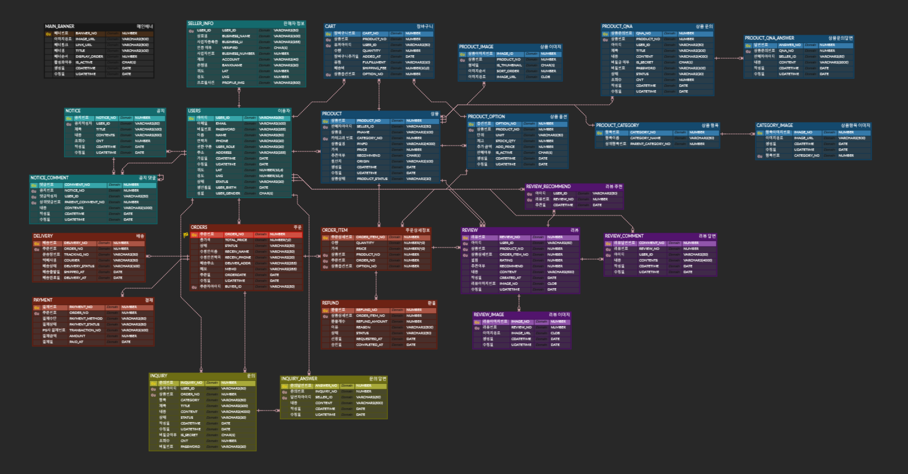

# AGRICOLA

<!-- 간단한 한 줄 소개 -->

> 농수산물 직거래 플랫폼 AGRICOLA,
> AGRICOLA는 라틴어로 농부를 뜻하는 말로 농부와 소비자 간에 직거래를 할 수 있도록 이어주는 사이트입니다.

---

## 📌 대표 이미지

<!-- 프로젝트 대표 스크린샷 또는 배너 (예: /docs/images/cover.png) -->

<p align="center"></p>

---

## 🧭 프로젝트 소개

* **배경/문제 인식:** 산지-소비자 간 정보 비대칭, 유통 마진 문제
* **목표/핵심 가치:** 신선도/공정가격/투명한 이력 관리
* **타깃 사용자:** 중소 농가, 신선식품 구매자

## 🗓 개발 기간 & 일정

> 전체 기간: `2025.10.23 ~ 2025.11.10`

## 👥 팀원 구성

| 이름    | 역할     | 깃허브 | 이메일 
| ----- | ------ | -------------------------- | ------ |
| 김성민 | 팀장/프론트엔드/백엔드 | https://github.com/Kimseongmin3790 | sungmin3790@gmail.com 
| 권혁준 | 프론트엔드/백엔드    | https://github.com/hyeokjun96 |  hyeokjun96@gmail.com
| 이민형 | 프론트엔드/백엔드  | https://github.com/sinso5281532 | sinso5281532@gmail.com
| 문병서 | 인프라    | https://github.com/bsmoonbs |  bsmoonbs@gmail.com

---

## 🧰 사용 스킬

### 🎨 프론트엔드


### 💻 백엔드


### 🗄️ 데이터베이스


### ⚙️ 기타


---

## 🗂 프로젝트 구조
```
Team2_SpringProject/
├── pom.xml                # Maven 빌드 설정 파일
├── README.md              # 프로젝트 설명 파일
└── src/
    ├── main/
    │   ├── java/
    │   │   └── com/
    │   │       └── example/
    │   │           └── TeamProject/
    │   │               ├── TeamProjectApplication.java  # 스프링 부트 시작점
    │   │               │
    │   │               ├── common/              # 공통 기능 (보안 설정, 예외 처리 등)
    │   │               │   ├── SecurityConfig.java
    │   │               │   └── GlobalExceptionHandler.java
    │   │               │
    │   │               ├── config/              # 설정 관련 클래스 (OAuth 등)
    │   │               │   └── auth/
    │   │               │
    │   │               ├── controller/          # 웹 요청을 처리하는 컨트롤러
    │   │               │   ├── UserController.java
    │   │               │   ├── ProductController.java
    │   │               │   ├── OrderController.java
    │   │               │   └── ... (기타 컨트롤러)
    │   │               │
    │   │               ├── dao/                 # 비즈니스 로직을 처리하는 서비스
    │   │               │   ├── UserService.java
    │   │               │   ├── ProductService.java
    │   │               │   └── ... (기타 서비스)
    │   │               │
    │   │               ├── mapper/              # MyBatis 매퍼 인터페이스
    │   │               │   ├── UserMapper.java
    │   │               │   ├── ProductMapper.java
    │   │               │   └── ... (기타 매퍼)
    │   │               │
    │   │               └── model/               # 데이터 모델 (VO, DTO)
    │   │                   ├── User.java
    │   │                   ├── Product.java
    │   │                   └── ... (기타 모델)
    │   │
    │   ├── resources/
    │   │   ├── application.properties   # 애플리케이션 설정 파일
    │   │   │
    │   │   └── mybatis-mapper/          # MyBatis SQL 쿼리 XML 파일
    │   │          ├── sql-user.xml
    │   │          ├── sql-product.xml
    │   │          └── ... (기타 SQL 파일)
    │   │   
    │   │  
    │   │      
    │   │
    │   └── webapp/
    │       ├── resources/               # 정적 리소스 
    │       │   ├── css/
    │       │   ├── js/
    │       │   └── img/
    │       │
    │       └── WEB-INF/                 # JSP 뷰 파일 위치
    │           ├── default.jsp          # 기본 템플릿 JSP
    │           ├── index.jsp
    │           ├── admin/
    │           ├── board/
    │           ├── user/
    │           ├── product/
    │           └── views/
    │               └── common/          # 공통 뷰 (헤더, 푸터)
    │                   ├── header.jsp
    │                   └── footer.jsp
    │
    └──
```

## ✨ 주요 기능

* [ ] 나와 가까운 판매자 조회(kakaomap API 연동)
* [ ] 회원가입/로그인, 소셜 로그인(옵션)
* [ ] 권한/역할(관리자/판매자/구매자)
* [ ] 상품 업로드(멀티 이미지, 옵션 SKU), 목록/필터/검색
* [ ] 장바구니/주문/결제(PortOne 등)
* [ ] 배송 조회(택배 API 연동)
* [ ] 상품문의/리뷰, 공지/이벤트
* [ ] 관리자 대시보드(통계/관리)


## 👥 팀원별 역할 분담

### 김성민 (팀장)
- **작업 페이지:**

    회원가입 페이지, 로그인 페이지, 메인 페이지, 관리자 페이지, 상품문의/고객문의 페이지
  
- **구현 기능:**

    CSS, 유효성 검사, 로그인 기능, 아이디/비밀번호 찾기, 카카오맵 api, 공통 헤더/푸터 스타일링, 상품/고객문의 기능, Apex Chart 그리기, 메일/문자 인증 추가

### 이민형
- **작업 페이지:**

    사용자 인증/마이페이지, 주문·결제·환불, 판매자 센터, 고객센터 
  
- **구현 기능:**

    소셜 로그인, 주문·환불 관리, 리뷰·댓글 시스템, DB 설계 및 ERD 작성

### 권혁준
- **작업 페이지:**

    상품 상세 페이지, 결제 페이지, 장바구니 페이지
  
- **구현 기능:**

    상품 썸네일, 상세 이미지 멀티 업로드 기능, 장바구니 조회, 주문 정보 조회, figma 업데이트

### 문병서
- **작업 페이지:**

    상품 목록 페이지
  
- **구현 기능:**

    CSS, 카테고리 필터링, 상품 필터링 검색 기능, 판매자 지역 필터링 

## 🗄 ERD & DB 설계

ERD 이미지(https://www.erdcloud.com/d/rkCfSHd6zyzgTdy8t)

 <!-- ERD 이미지를 클릭하면 원본 크기로 볼 수 있습니다. -->
 [](
 TeamProject/src/main/webapp/resources/img/erd.PNG)

* 스키마/DDL: `docs/db/schema.sql`

## 🖥 발표 자료 & 시연 영상

* 발표 PPT: [ppt보기](https://drive.google.com/file/d/1uDGNjkepO-dKUQeIpOhPxPQ-29l4lkpr/view?usp=drive_link)
* 시연 영상: [링크]()

## 🗃 기타 산출물

* 회의록: [회의록 보기](https://drive.google.com/drive/folders/1cmpl7d8eTH9VdNGQBTZcpIzHwe6FEHuG?usp=drive_link)
* 화면 설계서: [화면 설계서 보기](https://drive.google.com/drive/folders/1GgcUbCifE9YsqkxuhOjju2O_SPUpnjdr?usp=drive_link)
* 피그마: [피그마 링크](https://www.figma.com/files/team/1560527124714191383/project/472940087/%ED%8C%80-%ED%94%84%EB%A1%9C%EC%A0%9D%ED%8A%B8?fuid=1560527122324907792)
</details>


